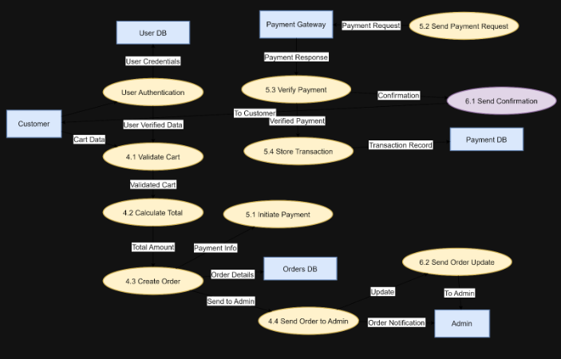
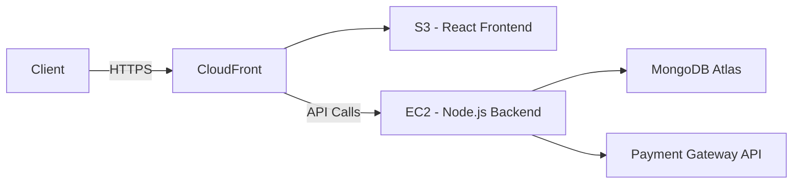

#  System Architecture Document  
## Rato Ghar Online Ordering Platform  
### Week 4 Deliverable  

---

## 1. Introduction  
Hi its my practise

### 1.1 Purpose  
This document presents the technical architecture of the Rato Ghar Online Ordering Platform. It defines the system structure, components, technologies, and data flow required to support an online food ordering system.

### 1.2 Scope  
The system allows customers to browse menus, place food orders, and complete payments online, while administrators can manage menu items and orders efficiently.

### 1.3 Intended Audience  
This document is intended for developers, system architects, project supervisors, and academic assessors involved in the design and evaluation of the platform.

### 1.4 Definitions and Acronyms  

| Term    | Definition                                      |
|---------|-------------------------------------------------|
| API     | Application Programming Interface               |
| JWT     | JSON Web Token                                  |
| REST    | Representational State Transfer                 |
| CRUD    | Create, Read, Update, Delete                    |
| UI      | User Interface                                  |
| AWS     | Amazon Web Services                             |
| ODM     | Object Document Mapper                          |

---

## 2. Architecture Style Decision  

### 2.1 Monolith vs Microservices  

The system adopts a **Monolithic Architecture** for the initial implementation.

### 2.2 Justification  
- Simpler development and deployment  
- Suitable for small to medium-scale applications  
- Faster development for academic/prototype purposes  
- Easier debugging, testing, and maintenance  

### 2.3 Future Scalability  
As the system grows, it can transition into a **Microservices Architecture**, separating key services such as:
- Authentication Service  
- Order Service  
- Payment Service  

---

## 3. Technology Stack  

| Layer          | Technology                  |
|----------------|----------------------------|
| Frontend       | React.js, HTML, CSS        |
| Backend        | Node.js with Express       |
| Database       | MongoDB                    |
| Authentication | JWT (JSON Web Tokens)      |
| Hosting        | AWS / Local Server         |

---

## 4. High-Level Architecture  

The system follows a layered monolithic structure consisting of presentation, application, and data layers.

### 4.1 Components  

- **Frontend (Client Layer)**  
  Built using React.js to provide an interactive user interface. Communicates with the backend via RESTful API calls over HTTP/HTTPS.

- **Backend (Application Layer)**  
  Developed with Node.js and Express to handle business logic and API requests. Exposes a REST API that the frontend consumes.

- **Database (Data Layer)**  
  MongoDB stores persistent data including users, orders, and menu items. Mongoose is used as the ODM layer for schema definition and validation.

- **External Services**  
  Payment gateway integration (e.g., Stripe or PayPal) for secure transaction processing.

---

## 5. System Architecture Diagram  


---

## 6. Application Layers  

### 6.1 Presentation Layer (Frontend)  
- Built with React.js using component-based architecture  
- Manages routing via React Router  
- State management handled with React Context API or Redux  
- Communicates with the backend through Axios HTTP calls  

### 6.2 Application Layer (Backend)  
- Express.js handles incoming HTTP requests and routes them to appropriate controllers  
- Middleware pipeline includes: authentication (JWT), input validation, error handling, and logging  
- Business logic is encapsulated in service modules  
- RESTful API endpoints follow standard HTTP conventions (GET, POST, PUT, DELETE)  

### 6.3 Data Layer (Database)  
- MongoDB is used as the primary NoSQL database  
- Mongoose schemas enforce data structure and validation  
- Collections: `users`, `menuItems`, `orders`, `payments`  

---


## 7. Authentication and Security  

### 7.1 Authentication Flow  
1. User submits credentials (email + password) to `/auth/login`  
2. Backend validates credentials and signs a JWT with a secret key  
3. Token is returned to the client and stored (e.g., in memory or `httpOnly` cookie)  
4. Client includes the token in subsequent requests via the `Authorization: Bearer <token>` header  
5. Backend middleware validates the token on protected routes  

### 7.2 Security Measures  
- Passwords are hashed using **bcrypt** before storage  
- JWTs have a configurable expiry (e.g., 1 hour for access tokens)  
- Input validation is applied on all incoming request bodies  
- HTTPS is enforced in production deployments  
- CORS is configured to allow only trusted origins  
- Rate limiting is applied to authentication endpoints to prevent brute-force attacks  

---

## 8. Deployment Architecture  

### 8.1 Development Environment  
- Local Node.js server  
- MongoDB running locally or via MongoDB Atlas (free tier)  
- Frontend served via React development server (`npm start`)  

### 8.2 Production Environment  
- **Backend**: Deployed on AWS EC2 or AWS Elastic Beanstalk  
- **Frontend**: Hosted on AWS S3 with CloudFront CDN, or via Vercel/Netlify  
- **Database**: MongoDB Atlas (cloud-hosted)  
- **Environment Variables**: Stored securely using AWS Secrets Manager or `.env` files not committed to source control  

### 8.3 Deployment Diagram  



---

## 9. Non-Functional Requirements  

| Requirement     | Target                                                    |
|-----------------|-----------------------------------------------------------|
| Performance     | API response time < 300ms under normal load               |
| Availability    | 99% uptime in production                                  |
| Scalability     | Horizontally scalable backend via load balancer           |
| Security        | JWT authentication, HTTPS, bcrypt password hashing        |
| Maintainability | Modular code structure following MVC pattern              |
| Usability       | Mobile-responsive frontend design                         |

---

## 10. Error Handling Strategy  

- All API errors return a consistent JSON structure:  
```json
{
  "success": false,
  "message": "Descriptive error message",
  "errorCode": "ERROR_CODE"
}
```
- HTTP status codes are used appropriately (200, 201, 400, 401, 403, 404, 500)  
- A global error handler middleware catches unhandled exceptions in Express  
- Frontend displays user-friendly error messages for failed API calls  

---

## 11. Assumptions and Constraints  

### 11.1 Assumptions  
- All users have access to a modern web browser  
- The system targets a single restaurant (single-tenant)  
- Payment gateway credentials will be provisioned prior to production deployment  

### 11.2 Constraints  
- The system is developed within an academic timeframe  
- Initial deployment may be limited to a local or low-cost cloud environment  
- No native mobile application is in scope for this phase  

---
