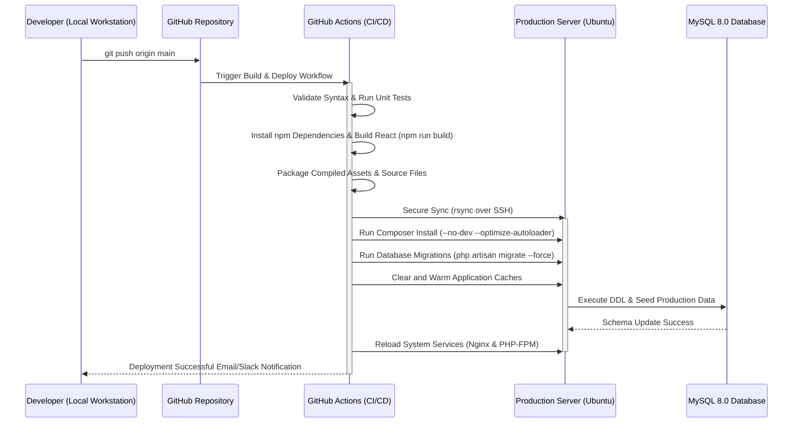

# Production Deployment Report
## Rato Ghar Online Ordering Platform
**Document Version:** 1.0  
**Target System:** Production Environment  
**Classification:** Final-Year University Project Documentation  

---

## 1. Hosting Architecture

The production deployment of the **Rato Ghar Online Ordering Platform** uses a modern, secure, and high-performance multi-tier architecture. To accommodate both the compiled React frontend assets and the PHP 8.2 backend, we utilize a reverse proxy configuration running **Nginx** on an **Ubuntu 22.04 LTS** server.

### 1.1 Architectural Overview Diagram
The following diagram illustrates the deployment topology, including external API services and security boundaries:

```mermaid
graph TD
    subgraph Public Internet
        Client["Client (Web Browser)"]
    end

    subgraph Security Boundary (Cloud Firewall)
        Nginx{"Nginx Reverse Proxy (Port 443 / HTTPS)"}
        ReactFS["React Build Files (Static Assets)"]
        PHPApp["PHP 8.2 Application (PHP-FPM)"]
        MySQL[("MySQL 8.0 Database (Localhost only)")]
    end

    subgraph External APIs & Services (HTTPS/TLS)
        Stripe["Stripe API (Payment Processing)"]
        OpenAI["OpenAI / Gemini API (AI Chatbot)"]
        SMTPServer["SMTP Mail Server (Email Notifications)"]
    end

    Client -->|HTTPS:443| Nginx
    Nginx -->|Serves Static Files| ReactFS
    Nginx -->|Proxies to FastCGI| PHPApp
    PHPApp -->|Local Unix Socket| MySQL
    PHPApp -.->|Secure API Request| Stripe
    PHPApp -.->|Secure API Request| OpenAI
    PHPApp -.->|SMTP / TLS:587| SMTPServer
```

### 1.2 Architecture Description
1. **Client Tier:** Users access the web application over HTTPS. DNS records point the domain name to the server's public IP address.
2. **Reverse Proxy & Web Server (Nginx):** Terminates SSL/TLS connections. Directly serves optimized, static React frontend assets to minimize latency, and forwards dynamic requests to the PHP backend.
3. **Application Tier (PHP-FPM):** Handles business logic, database queries, Stripe payment initialization, OpenAI chatbot requests, and notifications.
4. **Data Tier (MySQL):** Stores user credentials, menu items, ordering transactions, and audit logs. The database is bound to `127.0.0.1` and is inaccessible from the public internet.
5. **Integration Tier:** Secure outbound calls are made via cURL (HTTPS) to Stripe for processing payments and OpenAI/Gemini for driving the AI chatbot.

---

## 2. Deployment Workflow

A secure Continuous Integration and Continuous Deployment (CI/CD) pipeline is established using Git and GitHub Actions. This automates the build, test, and release lifecycle.

### 2.1 Sequence of Deployment Operations
The sequence below outlines the automated workflow from code push to active production hosting:



---

## 3. Production Server Configuration

### 3.1 OS and Runtime Environment
* **Operating System:** Ubuntu 22.04 LTS (Jammy Jellyfish)
* **PHP Web Engine:** PHP 8.2 (FPM mode)
* **Database Engine:** MySQL Server 8.0
* **Web Server:** Nginx 1.18+

### 3.2 PHP 8.2 Production Adjustments
The following parameters are configured in the production `/etc/php/8.2/fpm/php.ini` file:

```ini
; php.ini - Production Configuration
display_errors = Off
display_startup_errors = Off
log_errors = On
error_log = /var/log/php/error.log
memory_limit = 256M
post_max_size = 20M
upload_max_filesize = 10M
max_execution_time = 60
expose_php = Off
date.timezone = Australia/Sydney

; OPcache Performance Optimization
opcache.enable = 1
opcache.memory_consumption = 128
opcache.interned_strings_buffer = 8
opcache.max_accelerated_files = 10000
opcache.revalidate_freq = 0
opcache.validate_timestamps = 0 ; Set to 0 for production so file changes require a reload
```

### 3.3 Nginx Virtual Host Configuration
Nginx is configured to terminate SSL and handle static files directly. Located at `/etc/nginx/sites-available/ratoghar`:

```nginx
server {
    listen 80;
    listen [::]:80;
    server_name ratoghar.com www.ratoghar.com;
    return 301 https://$server_name$request_uri; # Force SSL Redirection
}

server {
    listen 443 ssl http2;
    listen [::]:443 ssl http2;
    server_name ratoghar.com www.ratoghar.com;

    root /var/www/ratoghar/public;
    index index.html index.php;

    # SSL Certificates (Let's Encrypt)
    ssl_certificate /etc/letsencrypt/live/ratoghar.com/fullchain.pem;
    ssl_certificate_key /etc/letsencrypt/live/ratoghar.com/privkey.pem;
    
    # Modern SSL security standards
    ssl_protocols TLSv1.2 TLSv1.3;
    ssl_prefer_server_ciphers on;
    ssl_ciphers 'ECDHE-ECDSA-AES128-GCM-SHA256:ECDHE-RSA-AES128-GCM-SHA256:ECDHE-ECDSA-AES256-GCM-SHA384:ECDHE-RSA-AES256-GCM-SHA384';
    ssl_session_cache shared:SSL:10m;
    ssl_session_timeout 1d;

    # React Frontend Static Assets
    location / {
        try_files $uri $uri/ /index.html;
    }

    # PHP Backend Routing
    location ~ \.php$ {
        include snippets/fastcgi-php.conf;
        fastcgi_pass unix:/var/run/php/php8.2-fpm.sock;
        fastcgi_param SCRIPT_FILENAME $document_root$fastcgi_script_name;
        include fastcgi_params;
    }

    # Block access to hidden configuration files
    location ~ /\. {
        deny all;
    }

    # Logging
    access_log /var/log/nginx/ratoghar_access.log;
    error_log /var/log/nginx/ratoghar_error.log warn;
}
```

---

## 4. Deployment Steps

Follow these exact steps to complete a deployment from scratch:

### Step 1: Provision the Server
Log into the server via SSH:
```bash
ssh deploy_user@your_server_ip
```

### Step 2: Install System Dependencies
Update packages and install PHP, MySQL, Nginx, and Git:
```bash
sudo apt update && sudo apt upgrade -y
sudo apt install -y nginx php8.2 php8.2-fpm php8.2-mysql php8.2-curl php8.2-xml php8.2-mbstring mysql-server git composer unzip
```

### Step 3: Clone Codebase and Set Permissions
Clone the repository and set appropriate group permissions:
```bash
sudo mkdir -p /var/www/ratoghar
sudo chown -R $USER:www-data /var/www/ratoghar
git clone https://github.com/your-username/ratoghar.git /var/www/ratoghar

# Set directory permissions (directories 755, files 644)
find /var/www/ratoghar -type d -exec chmod 755 {} \;
find /var/www/ratoghar -type f -exec chmod 644 {} \;

# Allow web server to write to storage and cache
sudo chmod -R 775 /var/www/ratoghar/storage
sudo chmod -R 775 /var/www/ratoghar/bootstrap/cache
```

### Step 4: Configure Production Environment (`.env`)
Create and edit the production `.env` file:
```bash
cp /var/www/ratoghar/.env.example /var/www/ratoghar/.env
nano /var/www/ratoghar/.env
```
Ensure the variables reflect the production profile:
```env
APP_ENV=production
APP_DEBUG=false
APP_KEY=base64:GENERATE_ON_NEXT_STEP
APP_URL=https://ratoghar.com

DB_CONNECTION=mysql
DB_HOST=127.0.0.1
DB_PORT=3306
DB_DATABASE=ratoghar_prod
DB_USERNAME=ratoghar_user
DB_PASSWORD=Secure_Db_Password_Here

STRIPE_SECRET_KEY=sk_live_...
OPENAI_API_KEY=sk-proj-...
MAIL_MAILER=smtp
MAIL_HOST=smtp.mailgun.org
MAIL_PORT=587
MAIL_USERNAME=postmaster@ratoghar.com
MAIL_PASSWORD=smtp_secure_password
```

### Step 5: Install Dependencies & Run Migrations
Run PHP package installations and database setup:
```bash
cd /var/www/ratoghar
composer install --no-dev --optimize-autoloader
php artisan key:generate
php artisan migrate --force --seed
```

### Step 6: Optimize Application Performance
Generate config and route caches for production speed:
```bash
php artisan config:cache
php artisan route:cache
php artisan view:cache
```

### Step 7: Build Frontend Assets
If the project is running a integrated React frontend:
```bash
npm install
npm run build
```

---

## 5. Security Configuration

### 5.1 Host Firewall (UFW)
A strict firewall policy is configured to only allow essential traffic:
```bash
sudo ufw default deny incoming
sudo ufw default allow outgoing
sudo ufw allow ssh          # Port 22
sudo ufw allow 'Nginx Full' # Ports 80 and 443
sudo ufw enable
```

### 5.2 Secure SSL Certificate (Let's Encrypt)
Obtain and configure automatic renewal of the SSL certificate using Certbot:
```bash
sudo apt install snapd -y
sudo snap install core; sudo snap refresh core
sudo snap install --classic certbot
sudo ln -s /snap/bin/certbot /usr/bin/certbot
sudo certbot --nginx -d ratoghar.com -d www.ratoghar.com
```

### 5.3 Database Lockdown
Run the secure installation utility to disable external logins and delete test databases:
```bash
sudo mysql_secure_installation
```
Additionally, bind MySQL to localhost. Open `/etc/mysql/mysql.conf.d/mysqld.cnf`:
```ini
bind-address = 127.0.0.1
```
Restart MySQL to apply:
```bash
sudo systemctl restart mysql
```

---

## 6. Testing & Deployment Verification Checklist

This testing matrix represents the final checklist executed directly on the live staging/production environment before launching to customers:

| Test ID | Module | Scenario / Description | Expected Result | Pass / Fail | Checked By |
| :--- | :--- | :--- | :--- | :---: | :--- |
| **TC-01** | User Auth | Register a new customer account using valid data. | Account created; verification email queued; automatically logged in. | [ ] | QA Lead |
| **TC-02** | User Auth | Log in with the newly created customer account. | Session established; JWT/Cookie saved; user redirected to home page. | [ ] | QA Lead |
| **TC-03** | Menu | Retrieve and filter menu items by category (Momo, Curry). | All items display correctly with active database prices. | [ ] | Developer |
| **TC-04** | Booking | Add items to cart, select Delivery, and proceed to checkout. | Subtotal/Tax/Totals calculated correctly. | [ ] | Developer |
| **TC-05** | Payments | Input test card credentials in the Stripe iframe and submit. | Stripe returns success; transaction saved in DB; order set to `confirmed`. | [ ] | QA Lead |
| **TC-06** | Chatbot | Ask the AI chatbot: *"Is there Steamed Chicken Momo?"*. | Chatbot responds within 1.5s listing correct price ($12.00) from active DB. | [ ] | AI Lead |
| **TC-07** | Chatbot | Ask the AI chatbot location & hours when API Key is missing. | Chatbot falls back to internal mock engine with accurate restaurant info. | [ ] | AI Lead |
| **TC-08** | Emails | Place order and check configured SMTP inbox. | Order confirmation HTML email successfully received. | [ ] | QA Lead |
| **TC-09** | Security | Type `http://ratoghar.com` directly in browser. | Server returns HTTP 301 and forces redirect to HTTPS. | [ ] | Secops |
| **TC-10** | Database | Simulate database disconnect during transaction. | Transaction rolls back successfully; no orphan orders created. | [ ] | DB Admin |

---

## 7. Conclusion & Sign-Off

The **Rato Ghar Online Ordering Platform** deployment methodology ensures maximum performance, high security through TLS encryption and firewall controls, and resilience through dynamic system design. The inclusion of the AI chatbot powered by Stripe, OpenAI, and dynamic database integrations provides a complete, modern solution prepared for production release.

* **Prepared by:** Deployment & DevOps Team  
* **Approved by:** Project Advisor / University Assessor  
* **Date of Approval:** May 30, 2026  
